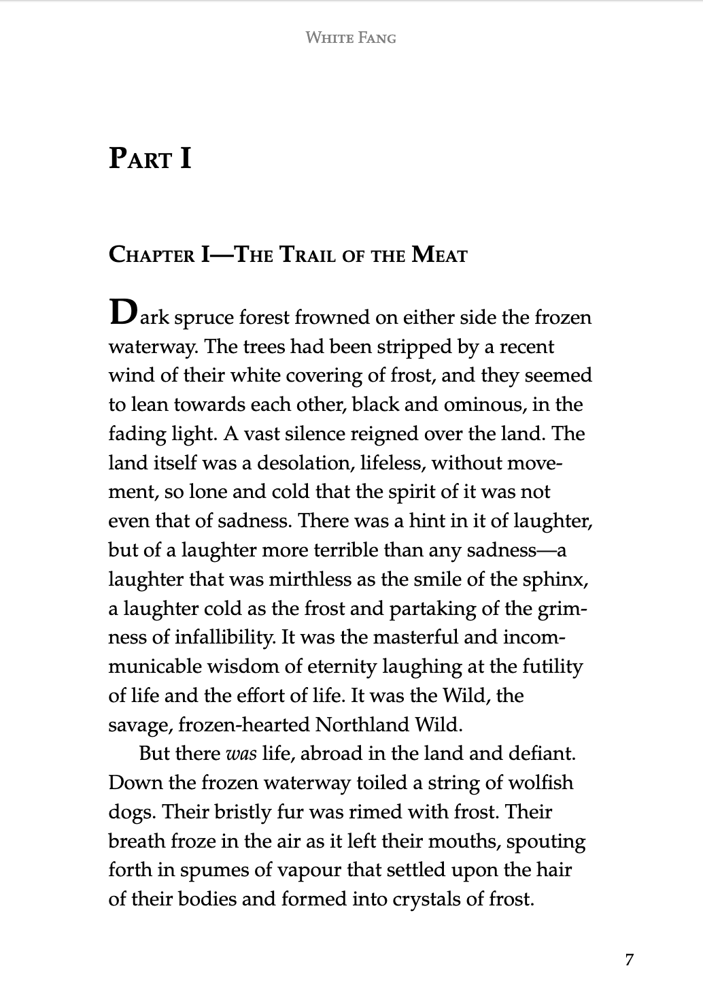

# 近いうちできるようになること {.cover}

# 原稿で `<body>` の class を設定

<div class="center">
<div>

```markdown:ch01.md
---
class: natsume
---
夏目漱石
```

```markdown:ch02.md
---
class: akutagawa
---
芥川龍之介
```

</div>

<div>

- vfm\@v1.0.0-alpha.18 にて[実装済み](https://github.com/vivliostyle/vfm/pull/78)
- **原稿ファイルごとのスタイル付与**が格段にやりやすくなる！
  - 先程の例だとこんな感じ

```scss:scss/theme_common.scss
body.natsume {
  h1, h2 { border-color: darkcyan; }
}
body.akutagawa {
  h1, h2 { border-color: sienna; }
}
```
</div>
</div>


# 欧文文庫用 Theme [#32](https://github.com/vivliostyle/themes/pull/32)




# 同時に複数の Theme を適用する

Theme をコンポーネント化してより細かい単位で使えるかも

```javascript:vivliostyle.config.js
theme: [
  'report.css',
  'twocolumn.css',
]
```


# Theme の構造に一貫性をもたせる

- 現状の必須項目
  - Theme 名
  - Theme を読み込んだときのデフォルトの CSS ファイル
- 現状の推奨項目
  - SCSS を使ってスタイルを書く
  - サンプル原稿を example/ に置く
- 将来的に推奨したい
  - Theme を変えても使える**共通のSCSS変数**（文字サイズ、行間など） [#19](https://github.com/vivliostyle/themes/issues/19)
