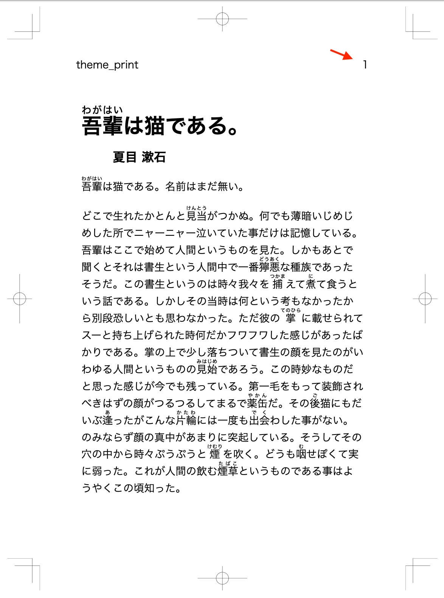
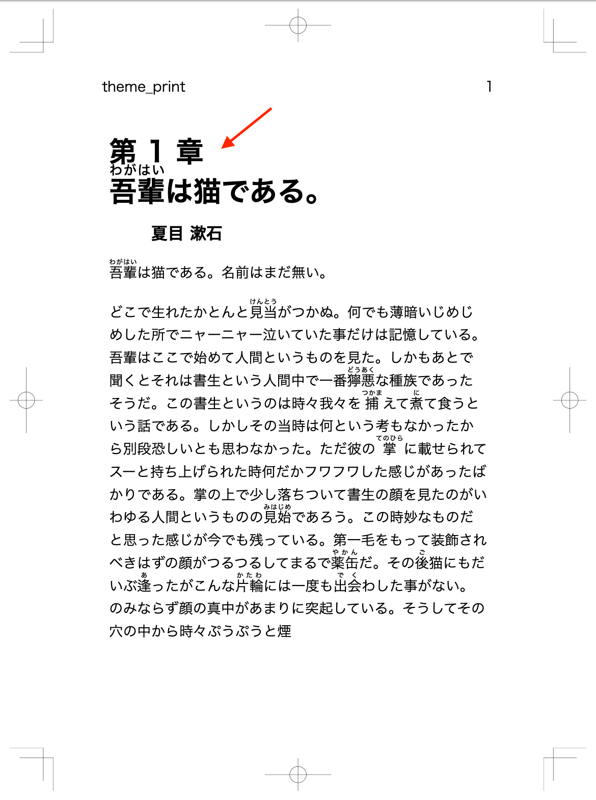
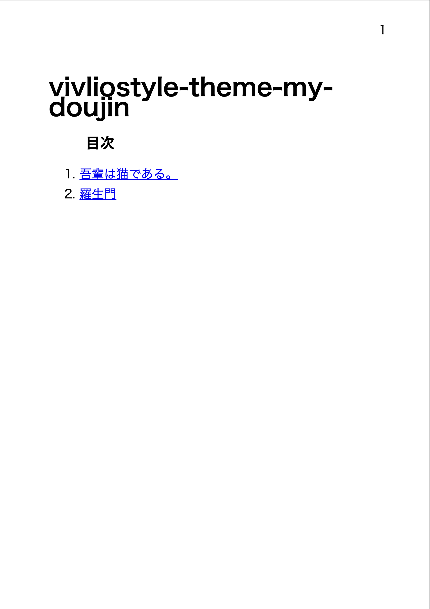
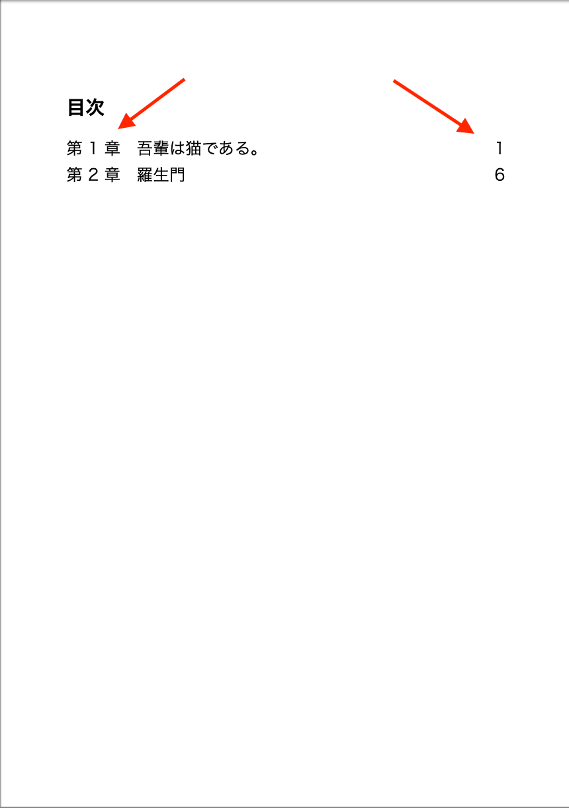

# Themes の作り方 {.cover}
良ければ一緒に手を動かしましょう 💻

https://github.com/yamasy1549/vivliostyle-theme-my-doujin

# このハンズオンの設定

- 「複数人の書き手による小説合同誌」を作ることになりました📖
- 1人1章分=1つの原稿ファイル (.md) を担当
- 全体を通した**ページ番号**、**章番号**がほしい
- **目次**がほしい
- 見た目は統一するが、**書き手によってテーマカラーを変えたい**

# ①雛形から作ります

`yarn create vivliostyle-theme my-doujin`

```shell
$ yarn create vivliostyle-theme my-doujin
? description すごい合同誌のTheme
? author name わたし
? author email watashi@example.com
? license AGPL-3.0
? choose category novel

Success! Created vivliostyle-theme-my-doujin.

1. cd vivliostyle-theme-my-doujin
2. edit scss/*.scss
3. publish to npm ($ npm publish)

✨  Done in 46.57s.
```

# ①雛形から作ります

```shell
$ cd vivliostyle-theme-my-doujin
$ tree . -I node_modules
.
├── LICENSE
├── README.md
├── example                  サンプル原稿
│   ├── default.html
│   └── default.md           🖋Markdownを書く
├── package.json
├── scss                     デフォルトで3つのスタイルファイル
│   ├── theme_common.scss    🖋 Themeの共通部分
│   ├── theme_print.scss     🖋 出版物 (PDF) 印刷用スタイル
│   └── theme_screen.scss    🖋 出版物 (HTML) 閲覧用スタイル
├── vivliostyle.config.js    🖋 プレビュー用設定ファイル
└── yarn.lock
```

# ②サンプル原稿を用意します

<div class="center">
<div>

```markdown:example/ch01.md
# {吾輩|わがはい}は猫である。
## 夏目 漱石
{吾輩|わがはい}は猫である。名前はまだ無い。
```
```markdown:example/ch02.md
# 羅生門
## 芥川 龍之介
ある日の暮方の事である。一人の{下人|げにん}が
```

</div>

```javascript:vivliostyle.config.js
module.exports = {
  language: 'ja',
  theme: 'theme_print.css',
  entry: [
    'example/ch01.md',
    'example/ch02.md',
  ],
}
```

</div>

# ③ `yarn dev` でプレビューします

これはデフォルトのスタイル


# ④ページ番号と章番号

<div class="center">
<div>

```css:scss/theme_{print,screen}.scss
/* ... */
@import "_my_style";
```

```css:scss/_my_style.scss
@page :first { counter-reset: p; }
@page { counter-increment: p; }

/* 小口側、上にページ番号 */
@page :left {
  @top-left { content: counter(p); }
}
@page :right {
  @top-right { content: counter(p); }
}
```

</div>

</div>


# ④ページ番号と章番号

<div class="center">

```css:scss/_my_style.scss
/* 章番号 */
@page :nth(1) {
  counter-increment: chapter p;
}

/* 章タイトル */
h1 {
  &::before {
    content: "第 " counter(chapter) " 章";
    display: block;
  }
}
```


</div>


# ④ページ番号と章番号

<div class="center">

```css:scss/_my_style.scss
/* 章タイトル */
h1 {
  border-top: 10pt solid black;
  &::before {
    content: "第 " counter(chapter) " 章";
    display: block;
    font-size: 80%;
    margin: 10pt auto;
  }
}

/* 著者名 */
h2 {
  text-align: right;
  border-bottom: 10pt solid black;
}
```


</div>

# ⑤ 目次

<div class="center">
<div>

```javascript:vivliostyle.config.js
module.exports = {
  // ...
  entry: [
    { rel: 'contents', theme: 'theme_toc.css' },
    // ...
  ],
  toc: true,
  tocTitle: "目次",
}
```

```css:scss/theme_toc.scss
@import "theme_common";
```

</div>


</div>


# ⑤ 目次

<div class="center">

```css:scss/theme_toc.scss
@import "theme_common";

/* いらないところを消す */
@page :left {
  @top-left { content: ""; }
}
@page :right {
  @top-right { content: ""; }
}
h1 { display: none; }
h2 { text-indent: 0; }

nav ol {
  padding: 0;
  list-style: none;
}
```


</div>


# ⑤ 目次

<div class="center">

```css:scss/theme_toc.scss
nav ol {
  /* ... */
  li a {
    text-decoration: none;
    color: inherit;
    &::before {
      content: "第 " target-counter(
                 attr(href url), chapter) " 章";
      margin-right: 1rem;
    }
    &::after {
      content: target-counter(attr(href url), p);
      float: right;
    }
  }
}
```


</div>


# ⑥原稿ごとのテーマカラー

<div class="center">
<div>

```javascript:vivliostyle.config.js
// ...
    {
      path: 'example/ch01.md',
      theme: 'theme_ch01.css',
    },
    {
      path: 'example/ch02.md',
      theme: 'theme_ch02.css',
    },
```

```css:scss/theme_ch01.scss
@import "theme_print";
h1, h2 { border-color: darkcyan; }
```

</div>

</div>
