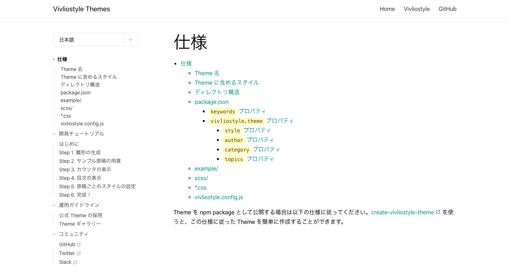

# Theme ドキュメントの紹介 {.cover}

https://vivliostyle.github.io/themes/#/ja/

# Theme に関するドキュメントを公開

- 仕様
- 開発チュートリアル
- 運用ガイドライン
  - 公式 Theme の採用
  - Theme ギャラリー

# 仕様 (1)

- Theme 名
  - 基本的に自由だが、なるべく**用途を表す用語**を含める
  - **変更可能なスタイルに関する用語を避ける**
    - 避けるべき例：a4book、tategaki など

- Theme に含めるべきスタイル
  - **出版物全体のスタイル**を含める
  - 例：ページ（余白、柱など）、見出し、段落、数式、図表ソースコード（キャプション）、脚注、ルビ
  - create-vivliostyle-theme の雛形をもとに作ることを推奨

# 仕様 (2)

- **サンプル原稿**が必須
  - Theme の良さがわかる端的なサンプル
  - Theme のユーザが出版物を作るとき参考にできそうなもの

- **SCSS** を推奨
  - Theme のユーザが自由にカスタマイズしやすいように
  - 将来的には CSS 変数（カスタムプロパティ）を使えるようになる予定だが、今のところは SCSS で変数などを定義

# Theme 開発チュートリアル

「[Vivliostyle Theme のつくりかた](https://vivliostyle.github.io/vivliostyle_doc/ja/vivliostyle-user-group-vol5/content/yamasy/index.html)」をもとに、最新の仕様に追従

# 公式 Theme の採用

- 条件
  - **汎用的**で**多くのユーザが使う**と思われる
  - **デザイン**と**主な用途**が、既存の公式 Theme と異なる
  - Theme の仕様を満たしている
- 採用方法
  - pull req
  - 採用されると themes リポジトリのメンテナ権限が与えられる

# Theme ギャラリー

公式 Theme と公式でない Theme を画像つきで一覧できる

