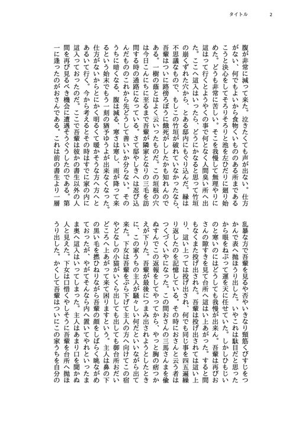

# 今後の予定 {.cover}

# 公開を予定している公式 Theme

- 小説同人誌用 Theme
  - 2段組み
  - 縦書き

# CSS 組版 tips の公開

- もっと CSS 組版のサンプルがほしい！　どんなことができるの？
- Theme 作りにも使える tips を (ドキュメント|公式サイト) でまとめたい
- 現在参考になる資料
  - [Vivliostyle がサポートする CSS 機能](https://docs.vivliostyle.org/#/ja/supported-css-features)
  - [Vivliostyle Core のテストケース](https://raw.githack.com/vivliostyle/vivliostyle.js/master/packages/core/test/files/)と[そのソース](https://github.com/vivliostyle/vivliostyle.js/tree/master/packages/core/test/files)
  - 公式ブログのリリース報告記事
  - 今日の発表者のスライド資料
