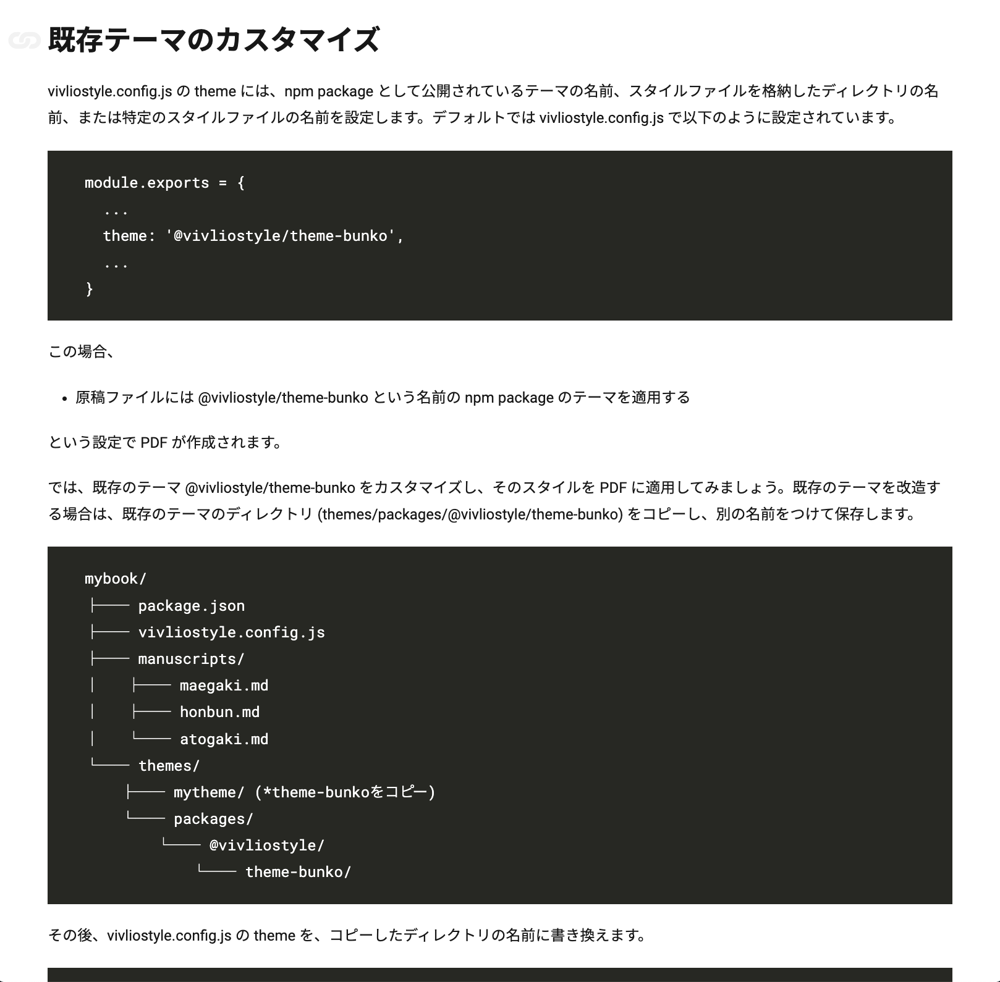
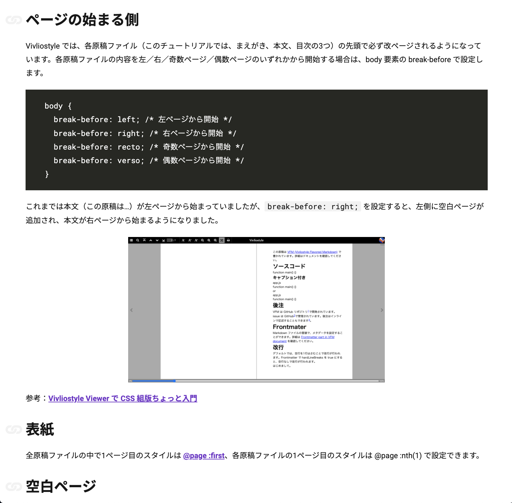
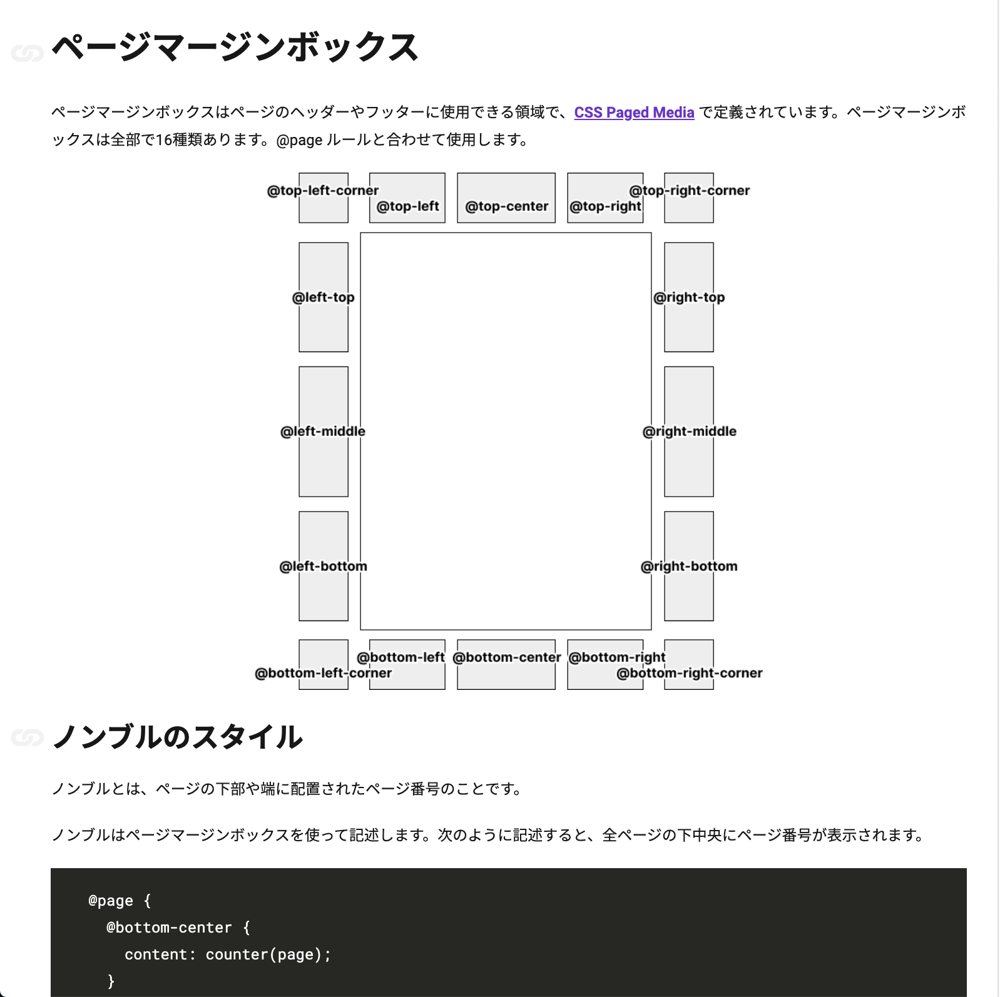
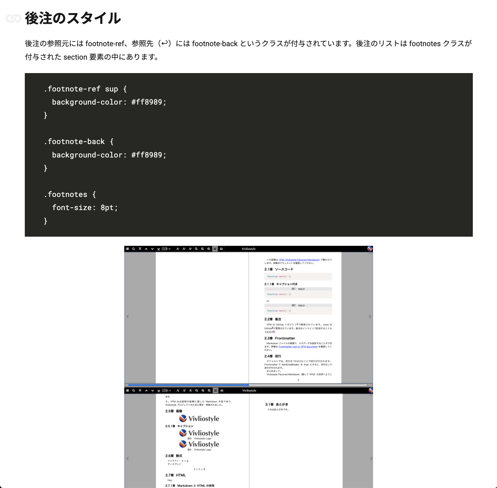
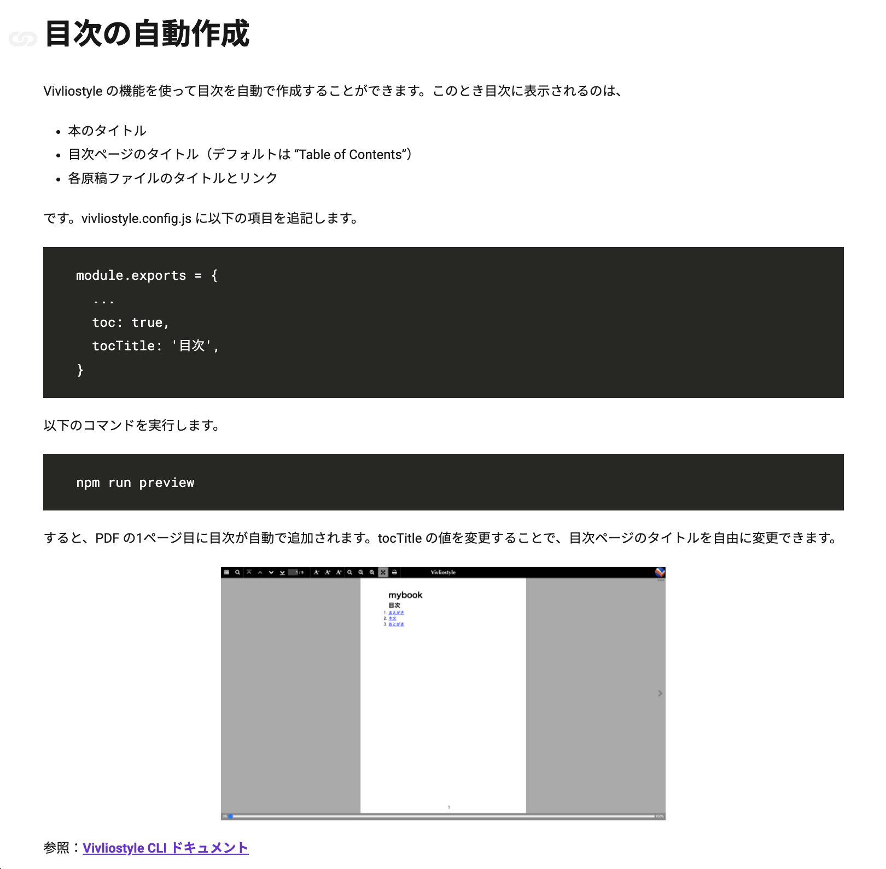
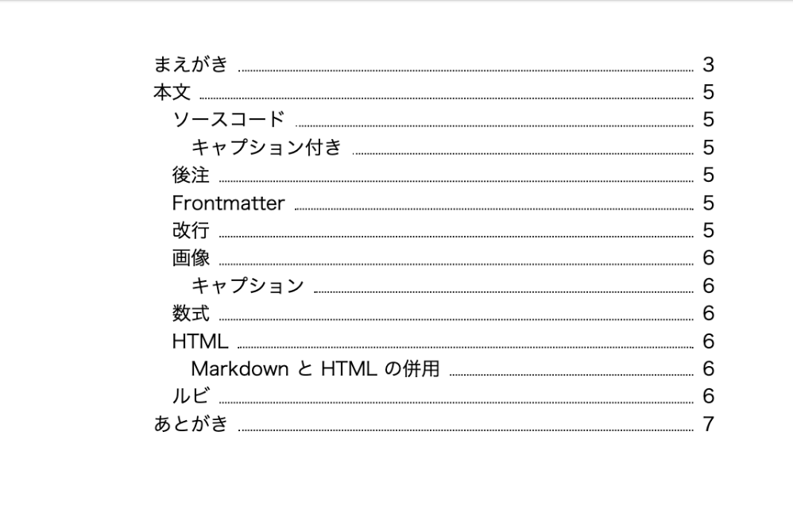

# チュートリアルの内容紹介 {.cover}

<https://vivliostyle.org/ja/tutorials/>

# チュートリアルの目標

- Vivliostyle を使って PDF 形式の出版物を作成できる
- CSS 組版に慣れていなくても、CSS 組版の基本が理解できる

# 目次

- ①インストール
- ②PDFの作成
- ③原稿とテーマのカスタマイズ
- ④用紙と文字のスタイル
- ⑤カウンタと柱のスタイル
- ⑥基本的な要素のスタイル
- ⑦目次の作成

# ①インストール

- Vivliostyle で出版物を作るための準備

# ②PDFの作成

- 雛形の作成
- PDF の作成
- プレビュー機能の使い方

# ③原稿とテーマのカスタマイズ

- PDF の作成に必要なファイル
- 設定ファイルの構造
- 原稿ファイル・**既存テーマのカスタマイズ方法**

# ④用紙と文字のスタイル

- 用紙の設定
  - 用紙サイズ・余白
  - **ページの始まる側**
  - **空白ページ**
- 文字の設定
  - 組方向
  - フォント
  - **行末処理**

# ⑤カウンタと柱のスタイル

- カウンタの設定
- ノンブルの設定
- 柱の設定

# ⑥基本的な要素のスタイル

- セクションのスタイル
- 見出しのスタイル
- ソースコードのスタイル
- 図のスタイル
- 後注のスタイル

# ⑦目次の作成

- 自動作成
- 手動作成

